# 삼국지 영걸전 맵 렌더러 (map-renderer.ts)

## 개요

삼국지 영걸전의 타일 기반 맵 데이터를 렌더링합니다. 타일셋 이미지와 맵 데이터를 조합하여 완전한 맵 이미지를 생성합니다.

## 사용법

```sh
# 전체 맵 렌더링
$ npx ts-node map-renderer.ts all

# 개별 맵 타입 렌더링
$ npx ts-node map-renderer.ts world   # 월드맵 (MMAP)
$ npx ts-node map-renderer.ts field   # 필드맵 (HEXZMAP)
$ npx ts-node map-renderer.ts battle  # 전투맵 (HEXBMAP)
$ npx ts-node map-renderer.ts town    # 마을맵 (SMAP)
$ npx ts-node map-renderer.ts palace  # 궁전맵 (PMAP)
```

---

## 지원 맵 타입

### MMAP (월드맵)

| 항목 | 값 |
|------|-----|
| 파일 | hero/MMAP.R3 |
| 타일셋 | hero/MMAPBGPL.R3 (255 타일) |
| 맵 수 | 4개 |
| 타일 크기 | 16×16 |

| 맵 | 크기 (타일) | 크기 (픽셀) |
|----|-------------|-------------|
| 0 | 96×96 | 1536×1536 |
| 1 | 72×112 | 1152×1792 |
| 2 | 120×88 | 1920×1408 |
| 3 | 112×128 | 1792×2048 |

### HEXZMAP (필드맵)

| 항목 | 값 |
|------|-----|
| 파일 | hero/HEXZMAP.R3 |
| 타일셋 | hero/HEXZCHP.R3 (Entry 0+1 또는 Entry 0+2) |
| 맵 수 | 58개 |
| 타일 크기 | 16×16 |

#### 데이터 구조

```
┌─────────────────────────────────────┐
│ 헤더 (2 바이트)                      │
│ - byte 0: width (타일 단위)          │
│ - byte 1: height (타일 단위)         │
├─────────────────────────────────────┤
│ 맵 레이어 (width × height 바이트)     │
│ - 각 바이트: 타일 인덱스 (0-254)      │
├─────────────────────────────────────┤
│ 지형 레이어 ((w/2) × (h/2) 바이트)    │
│ - 32×32 기준 이동/지형 정보           │
│ - 값 9 또는 11 포함 시: 황무지 타일셋  │
└─────────────────────────────────────┘
```

#### 타일셋 자동 선택

HEXZCHP.R3는 3개의 LS11 엔트리로 구성:
- **Entry 0**: 80 타일 (공통 기본 타일)
- **Entry 1**: 174 타일 (일반 지형)
- **Entry 2**: 175 타일 (황무지 지형)

지형 레이어에 값 9 또는 11이 포함되면 Entry 0+2 (황무지), 그 외에는 Entry 0+1 (일반) 사용.

### HEXBMAP (전투맵)

| 항목 | 값 |
|------|-----|
| 파일 | hero/HEXBMAP.R3 |
| 타일셋 | hero/HEXBCHP.R3 |
| 맵 수 | 9개 |
| 타일 크기 | 16×16 |

### PMAP (궁전/실내맵)

| 항목 | 값 |
|------|-----|
| 파일 | hero/PMAP.R3 |
| 타일셋 | hero/SMAPBGPL.R3 Entry 1 (실내 타일) |
| 맵 수 | 23개 |
| 타일 크기 | 16×16 |

#### 데이터 구조

```
┌─────────────────────────────────────┐
│ 맵 레이어 (32 × h 바이트)            │
│ - 헤더 없음, 타일 데이터 시작         │
│ - h = 20~21 (엔트리별 상이)          │
├─────────────────────────────────────┤
│ 이동 레이어 (31 × (h-1) 바이트)       │
│ - 타일 사이 이동 가능 여부            │
│ - 0xFF: 통과 가능                   │
│ - 0x7F: 통과 불가                   │
├─────────────────────────────────────┤
│ 이벤트 데이터 (가변)                  │
│ - 이벤트 좌표 등                     │
└─────────────────────────────────────┘
```

### SMAP (마을맵)

| 항목 | 값 |
|------|-----|
| 파일 | hero/SMAP.R3 |
| 타일셋 | hero/SMAPBGPL.R3 Entry 0 (야외 타일) |
| 맵 수 | 12개 |
| 타일 크기 | 16×16 |
| 맵 크기 | 32×20 타일 (512×320 픽셀) |

#### 데이터 구조

```
┌─────────────────────────────────────┐
│ 맵 레이어 (32 × 20 = 640 바이트)     │
│ - 각 바이트: 타일 인덱스 (0-219)      │
│ - 타일 60: placeholder (검은색)      │
├─────────────────────────────────────┤
│ 오버레이 레이어 (32 × 21 = 672 바이트) │
│ - 0xFF: 투명 (렌더링 안함)           │
│ - 0x7F: 충돌 마커                   │
│ - 기타: 오버레이 타일 인덱스          │
├─────────────────────────────────────┤
│ 이벤트 데이터 (가변)                  │
│ - (x, tile, row) 트리플렛 형식       │
│ - NPC/이벤트 위치 정보               │
└─────────────────────────────────────┘
```

#### 참고사항

- 맵 레이어의 타일 60은 검은색 placeholder로, 게임 런타임에서 캐릭터가 건물 뒤를 지나갈 때 동적으로 처리됨
- 오버레이 row 19-20에 wall top 타일 인덱스가 저장되어 있으나, placeholder 위치와 직접적으로 매핑되지 않음
- 정적 렌더링에서는 일부 건물 상단이 검은색으로 표시될 수 있음

---

## 스크린샷

### 월드맵 (MMAP)

#### 맵 0


#### 맵 1


#### 맵 2


#### 맵 3


### 필드맵 (HEXZMAP)

#### 0. 사수관


#### 1. 호로관


#### 2. 광천


#### 3. 신도


#### 4. 거록


#### 5. 청하


#### 6. 계교


#### 7. 북해


#### 8. 서주


#### 9. 소패


#### 10. 태산


#### 11. 하구


#### 12. 팽성


#### 13. 하비


#### 14. 신도1


#### 15. 광릉


#### 16. 연주


#### 17. 고성


#### 18. 영천


#### 19. 여남


#### 20. 강하


#### 21. 남양


#### 22. 박망파


#### 23. 신야1


#### 24. 양양


#### 25. 장판파1


#### 26. 장판파2


#### 27. 강릉


#### 28. 공안


#### 29. 계양


#### 30. 무릉


#### 31. 영릉


#### 32. 장사


#### 33. 부


#### 34. 성도


#### 35. 와구관1


#### 36. 와구관2


#### 37. 가맹관1


#### 38. 가맹관2


#### 39. 정군산


#### 40. 천탕산


#### 41. 한수


#### 42. 양평관


#### 43. 서릉


#### 44. 이릉


#### 45. 맥


#### 46. 남사


#### 47. 신야2


#### 48. 완1


#### 49. 완2


#### 50. 허창1


#### 51. 허창2


#### 52. 진창


#### 53. 장안


#### 54. 낙양


#### 55. 업1


#### 56. 업2


#### 57. 업3


### 전투맵 (HEXBMAP)

#### 0


#### 1
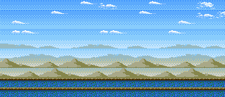

#### 2
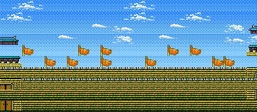

#### 3
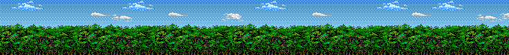

#### 4


#### 5
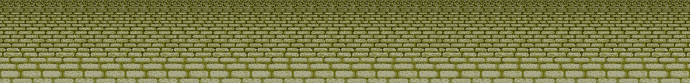

#### 6
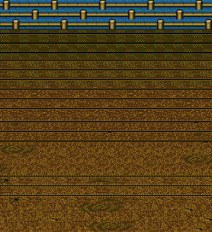

#### 7
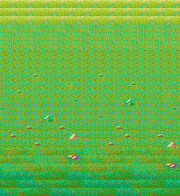

#### 8
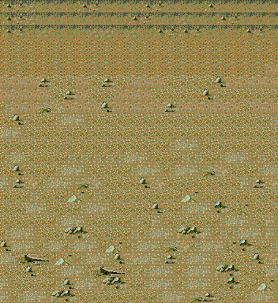

### 궁전맵 (PMAP)

#### 0
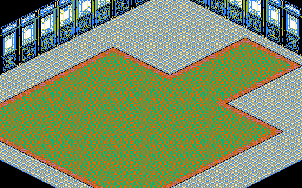

#### 1
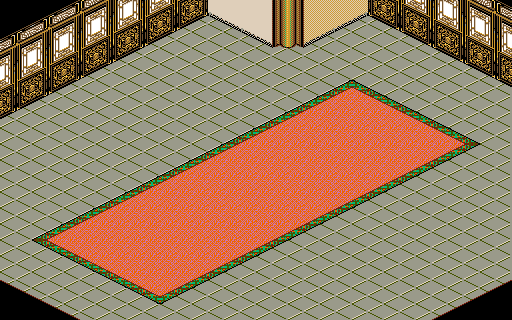

#### 2
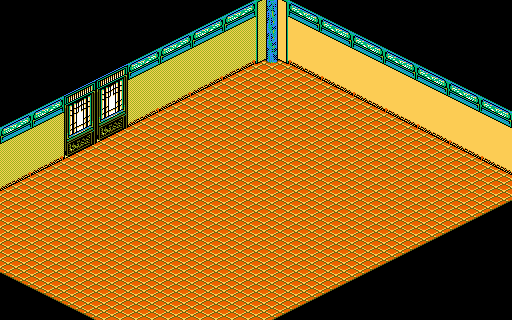

#### 3
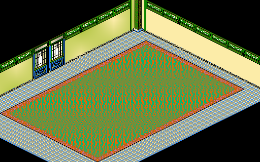

#### 4
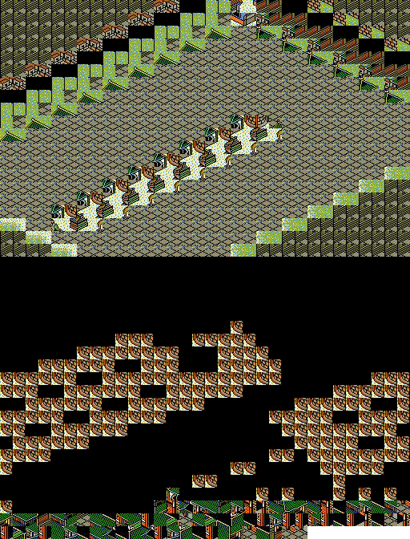

#### 5
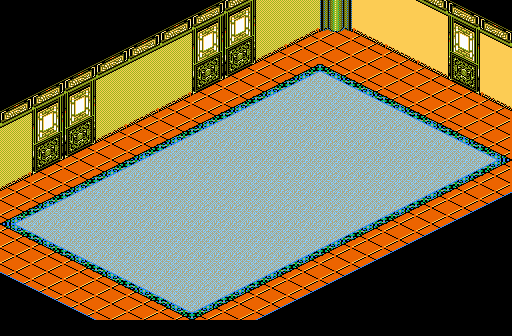

#### 6
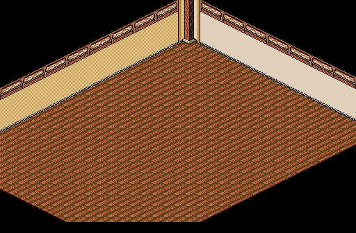

#### 7
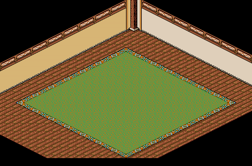

#### 8
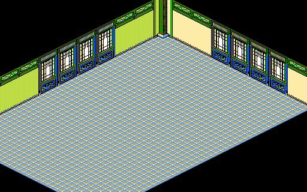

#### 9
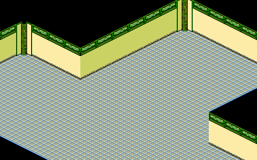

#### 10
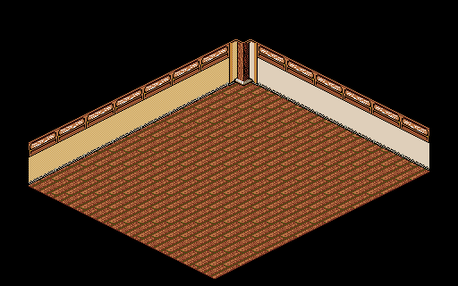

#### 11
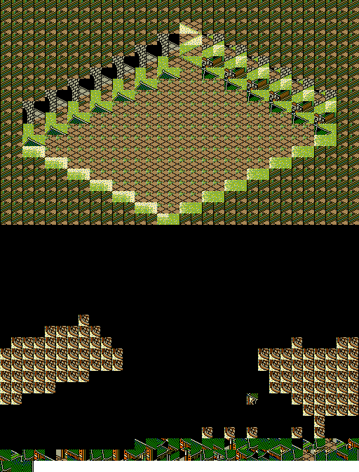

#### 12
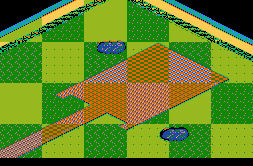

#### 13
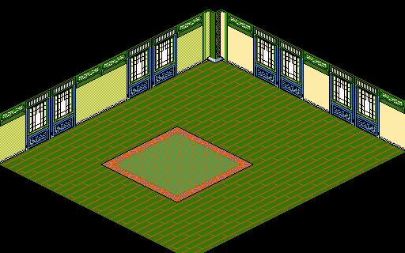

#### 14
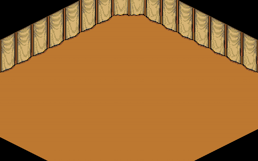

#### 15
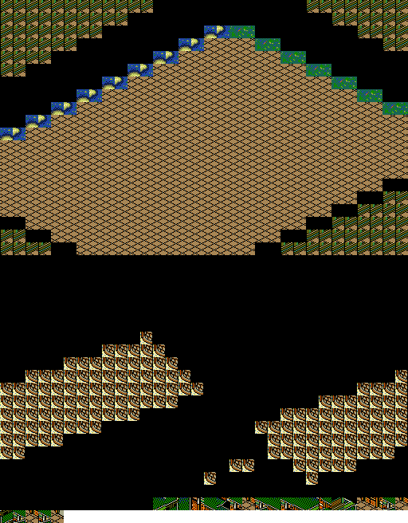

#### 16
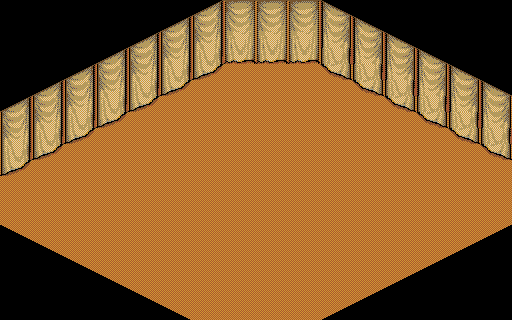

#### 17
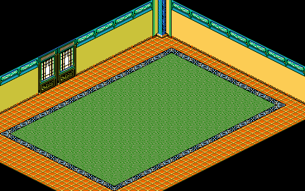

#### 18
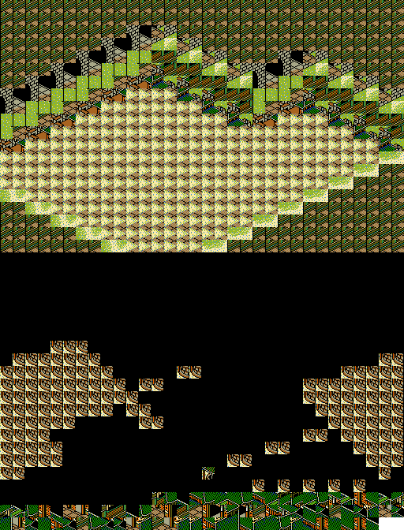

#### 19
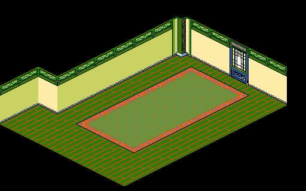

#### 20
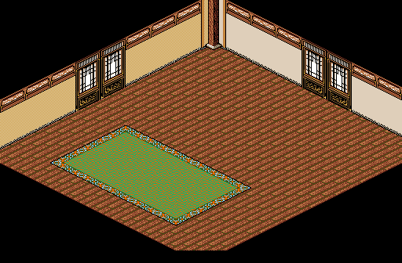

#### 21
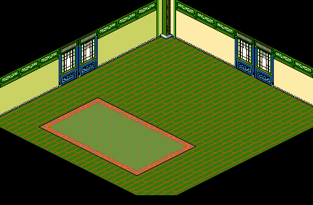

#### 22


### 마을맵 (SMAP)

#### 0
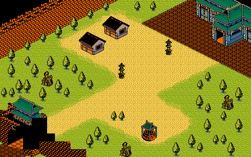

#### 1
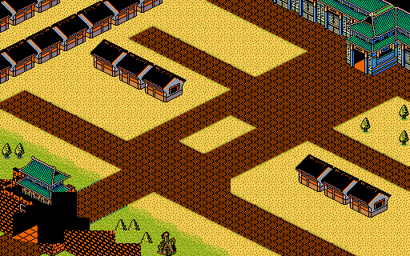

#### 2


#### 3
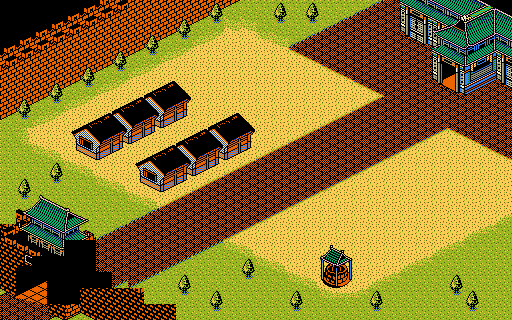

#### 4
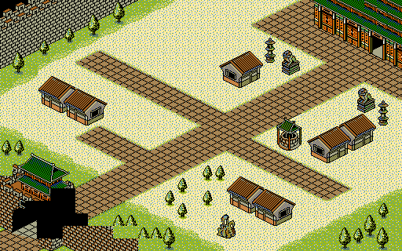

#### 5
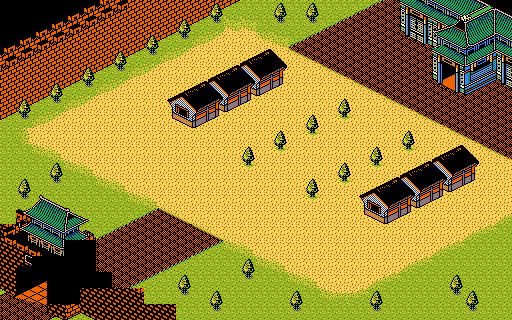

#### 6
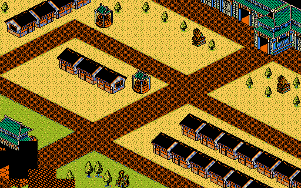

#### 7
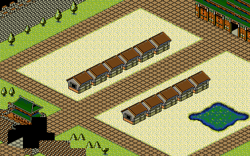

#### 8
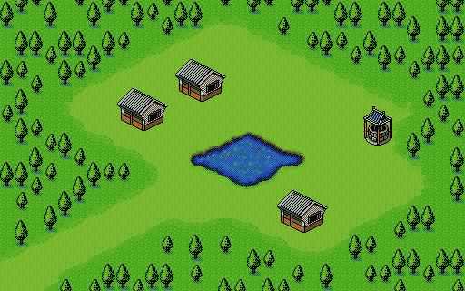

#### 9
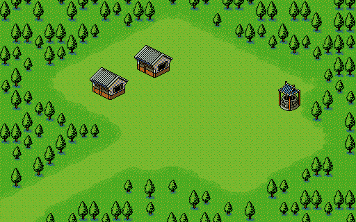

#### 10
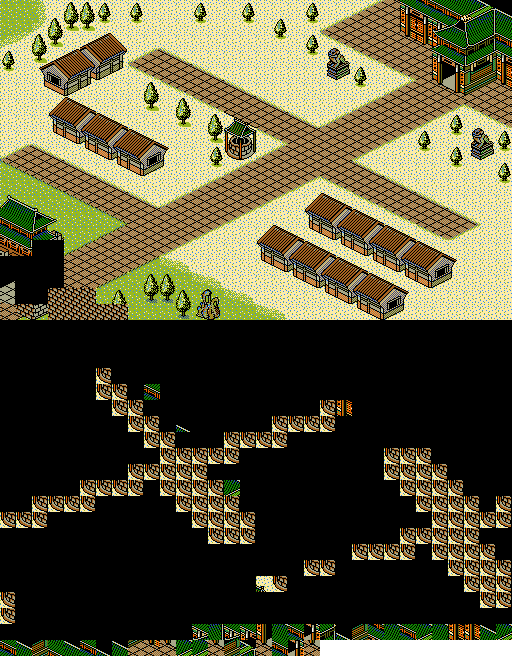

#### 11
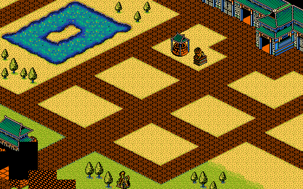
